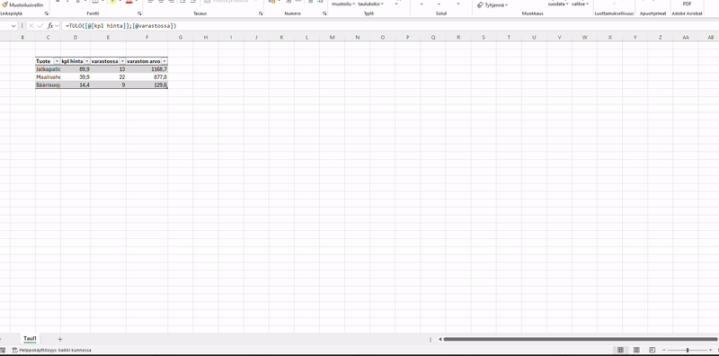

# Python-Tricks
## Sisällysluettelo
- [Pythonilla toteutettu Excel-automaation esimerkki, jossa haetaan lähdetiedostosta taulukon data eri tavoin](#pythonilla-toteutettu-excel-automaation-esimerkki-jossa-haetaan-lähdetiedostosta-data-eri-tavoin)

### Pythonilla toteutettu Excel-automaation esimerkki, jossa haetaan lähdetiedostosta taulukon data eri tavoin:
- Kopiointi sellaisenaan.
- Kopiointi, jossa ulkoasua muutettu, mutta viimeisen sarakkeen kaavoja ei ole otettu mukaan, ainoastaan arvot.
- Kuten edellä, mutta viimeisen sarakkeen kaavat otettu mukaan.

